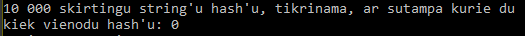

## V0.2

# Hash funkcija

Veikia paversdama kiekvieną įeities simbolį į 8 bitus ir sujungia juos visus į bitų vektorių. Tada juos pakaitalioja, vektoriaus indeksą pasirinkdama rand() funkcija (sėkla yra įvesties simbolių ascii lentelės indeksų suma, taigi algoritmas deterministinis). Tada išimami 30 po 6 bitus. Tie bitai paverčiami simboliais iš Base64 lentelės ir sudedami į string'ą, kuris ir yra mūsų hash'as. 

# Testai

### Laisvos įvestys

Ta pati įvestis duoda tą pačią maišą ir pan...

### Testai su failais (1 testas)

| Įvedimo failas | Išvedimas                   |
| ------------------ | ------------------------------- |
| tuscias failas | H+rcCBhy6FPQ4uNmqoFmeyeq9Oh6qW |
| failas su vien 'a' raide | iGWYYshLWsshYwFwLwWhCFLhWshFYh |
| failas su vien 'G' raide | H2ia6j666ROj0jdRRRHHRjHRH0jOOH |
| failas su vien 'G' raide, bet vienas simbolis pakeistas | K+d6dO0oo000HH66jo66O0oR0jRH0d |
| failas 1 su atsitiktiniais simboliais | ekB8uyZNiZeGoNqhbtjmHpw9CUsZsq |
| failas 2 su atsitiktiniais simboliais | rosEUrTBb0IOITk7VM7CWV8bisURKK |
| failas 3 su atsitiktiniais simboliais | TpRT3XSfxSINkR3wtaebGuKYbjSZ0Z |
| failas su tais pat atsitiktiniais simboliais kaip 3, tik vienas simbolis pakeistas | I/sWn256hmvALSAR09+w9ht0jTR67m |

### Spartumo skaičiavimas (2 testas)

Kiekviena eilutė iš Lietuvos Konstitucijos.

Iš viso užtruko 1375 milisekundžių. Visų eilučių į lentelę nekopijuosiu, nes tiesiog vietą užims. Tik kelias pavyzdžiui.
Maišos laikas tiesiogiai proporcingas įeigos eilutės ilgiui.

| Eilutės maiša | Laikas mikrosekundėm |
| --- | --- |
 | FV2C+ezygftwITy8FRf5JfSv6Zx8nq | 1448 |

 | 7DUTLlH5/wgVfJEDnBhrC2EMV+KGTK | 956 |

 | jBBJWlqfoqtG84Njtm5rKOs+AsvADX | 905 |

 | H7SzR/h6a/X5C1/treAFyYkPI4ocQv | 821 |

 | hHfqLJjdOS57WQQhgYUEU9NIKIoEzz | 421 |

 | vfCZX0SgoZQk4+aI7PHAEhMAHM+tOj | 1945 |

 | msFO5bpBR77KsGCNEN8zHAkTKGs23A | 317 |

 | 4X+6F8dgIZkOtf6Kw21HsDRv3Jzcf5 | 1022 |

 | Lgx0+l8T9ZVJVRGXLJdl/3hUMqebQy | 1937 |

 | 3hS+03tCiVH+JUuM7Q11juiGNXeSRg | 1296 |

 | Xh6ITEh5XNCb6wICAAg5DydZgNRExH | 1169 |

 | Tgrb1yOU0Q+D1pDVsOPLLp2V+3cS3f | 2845 |

 | RCtc3W0Tyu86klQ3tV7dpO7xYWHZg1 | 1060 |

 | ZVO6Ej+IAPMjnjaZYrWOTCchEmI154 | 3749 |

 | tU1q21MjK61kzxZhPVFh4yJ9teCUKP | 1661 |

 | +cgRvPS6aS/Bp13qn6zCcEhACoF7Mn | 310 |

 | G0AnqrigMmOt3+PDHPlqMYRGf2FZui | 396 |

 | u6HHgq4pWACT/dC3TddvEBa86i48we | 403 |

 | Gi9tPedWizL45RpwSnaswDu6Buo+on | 1371 |

 | 7ywclatyhmcuKWT7QXlb/SZ8INB/7w | 448 |

 | fkxQ6lUfigTyn7jaWCURyHiLjm1krq | 1461 |

 | 6jvqB3EO9FguazAxBSDd9CfHY9Dzak | 422 |

 | 3ZkJYbqrNZHS6cIyebcOeZ5cHNK3Op | 2261 |

 | GL9h3e6kwzplgG//ww4io88/K6Awmp | 4010 |

 | WEGEyrcISGXiOGmZ0CUWYYuoChPTTg | 530 |

 | Bu4YGO05oGQr4XvyG/pKSuP79S67bX | 2210 |

 | sWgE8xHlGIehWXBPb1vwc/u+vujdYW | 382 |

 | aVbKx5+B0vS7EP98IqNIDgFzWx5Frb | 2153 |

 | pfTy95A9dawUsCFoWlMDTeDBtY7f8f | 760 |

 | 2frQaV8GSJgP/lrXnNr2djYCILE89u | 769 |

 | zhQWD89Dem9lpUfzhfrSb//jlwCNc3 | 337 |

 | k4tNmUVuMDsuhzfPkRCFeZNYVV/5ME | 1242 |

 | zRA+e60sHnsocmaG7jqu6NagjRe7Ec | 1277 |

 | bazhEnBjbV6P5Gqiqzx6ZyzPC5Jk1e | 338 |

Manau, funkcija visai greita, nes pats maišymas vyksta su bool vektorium, turbūt daugiausia laiko užima string'o išskirstymas į simbolius ir/ar gautų simbolių sukišimas į string'ą.

### pasikartojimas (3 testas)

Šiek tiek kitaip atlikau užduotį. Vietoj porų, tiesiog sugeneravau 10 000 skirtingų string'ų (per https://www.random.org/strings/) ir parašiau funkciją, suskaičiuojančią kiek iš viso yra vienodų išvestų hash'ų.

Šiuo atveju, regis nebuvo nei vieno vienodo hash'o. Maišos funcija visai neblogai maišo...
(* kartais paskutinė input failo eilutė perskaitoma du kartus, taigi output faile pačiam gale atsiranda 2 vienodi hash'ai. Input faile gale neturėtų būti naujos eilutės, man atrodo...)

### panašumas tarp porų (4 testas)

Dauguma turi daugmaž pusę sutampančių bitų. Simbolių lygmenyje tai visgi atrodo gan skirtingai... Neradau nei vienos 100% sutampančios poros.
(* paskutinė input failo eilutė kartais yra hash'uojama 2 kartus taigi paskutinė hash'uota "pora" gali rodyti, jog sutampa 180/180)

Pavyzdys:

| pirmas hash'as | antras hash'as | kiek bitų sutampa | statusas |
|---|---|---|---|
| hULh1WHxix/fVKpezSayGldDw6dTWc | tUFljOoUeDjGB6rFli2YWSU5+j9N1c | 102/180 | siek tiek panasu, iki 66 proc panasumo |
| mNIBITEYPrqJlbGNp5w1LI4FkXW1Cs | Oaps06K9LYOjeAjZYog5aAUOWyVVvS | 96/180 | siek tiek panasu, iki 66 proc panasumo |
| GVwaEABhYEjjJ9nrUnHB9zXvUpbJaV | FRp1sv1DicnCkpmNknOIU0HqO1Eu/M | 102/180 | siek tiek panasu, iki 66 proc panasumo |
| HaWAroGo7mKtaBjsPe/zwTrwqM4brA | WtSxY8I37FmgNjkloxkliZ56wLPqxe | 90/180 | siek tiek panasu, iki 66 proc panasumo |
| J5Ty9hv2j3C/BzjwrwDbg5N+4FWf+i | 1UVze2o5MI6mPrmKRTsZxUCXtBT94R | 87/180 | siek tiek panasu, iki 66 proc panasumo |
| qHBptyLaBnMvpHg495mKIqcD8imlbR | 0gu1cwsK7utngPz1ZLMC5uXd34G7rh | 102/180 | siek tiek panasu, iki 66 proc panasumo |
| VAtZY7UsVocOpcgLqe7Wfq3K6uJcUA | VOqJomqdIDStNxwp9UWTH6WSKGGeZJ | 103/180 | siek tiek panasu, iki 66 proc panasumo |
| 76kGeAtpYVXsXYf7M2kudQ9j1q1A1X | TeCknFqhqX1Ggc4F3zYdO+iExzx7/n | 92/180 | siek tiek panasu, iki 66 proc panasumo |
| LjwQ9qdCc44e2Ygc8Oqqk56ah5Fpjy | kejlzgCdTaZNK5QiFh0Bk9ic55yCa8 | 84/180 | siek tiek panasu, iki 66 proc panasumo |
| RjqXVF4OwKnbfXeAb+QsUujfldlMmH | NFhxXzpWKr2hC/0rMu5Ee/mwAyRP/m | 95/180 | siek tiek panasu, iki 66 proc panasumo |
| ezsSFtnWKXj9UdPbTfSE7diJmMy2rA | Cf6vkANy7ntSCeUTnlrFVcCEkH1htG | 96/180 | siek tiek panasu, iki 66 proc panasumo |
| 3CkoGhqmWH9jAh1IW73tQq0LUHEJlH | ZsdzRAQUh+TNfLdGrdeiYmsKlORdA7 | 83/180 | siek tiek panasu, iki 66 proc panasumo |
| sWj7K6yVar0q+bq90SKO049SCMIVjU | OP5PQWdsyyMuKIjng7RuVcGvOpDG4q | 90/180 | siek tiek panasu, iki 66 proc panasumo |
| 0CgJuMvmMhLdo8vzWgk1I/nne3qYbC | n1MHbDuhCUmIbXeymso3iMftJYfeyM | 88/180 | siek tiek panasu, iki 66 proc panasumo |
